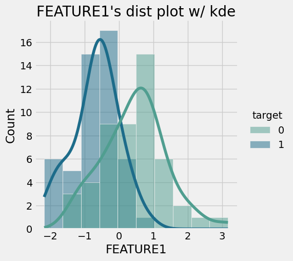
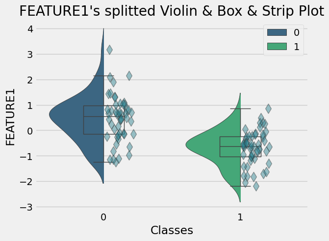

# ABpy: Pythonic A/B Test in 2 lines.

Install
-------

First, clone repository using git clone.

```zsh
$ git clone https://github.com/noepinefrin/ABpy.git
```

Then, install the dependencies.

```zsh
$ pip install -r requirements.txt
```

Now, you can analysis what you want.


Example
-------

#### Load Dataset

```python
from sklearn.datasets import load_breast_cancer
import pandas as pd

brca = datasets.load_breast_cancer(as_frame=True)
brca_data = pd.concat([brca.data, brca.target], axis=1)
```

#### Import module

```python
from ab.ab import ABpy

brca_abpy = ABpy(data=brca_data, target_class='target', test_variables=brca.data.columns, significance_level=0.05)
brca_ab_results = brca_abpy.apply(verbose=False) # returns pd.DataFrame, when you are using verbose=True, you also get the interpretation of the variables.
```

#### What is the dataframe looks like?

```python
brca_ab_results.head(3)
```


|           | Distribution of A | Distribution of B | Shapiro P-Value of A | Shapiro P-Value of B | Shapiro W-Value of A | Shapiro W-Value of B | Equal Variance | Levene P-Value | Levene F-Value | T-Test P-Value | T-Test T-Value | Mann Whitney U-Test P-Value | Mann Whitney U-Test U-Value | Mean Ratio | Median Ratio |
|:---------:|:-----------------:|:-----------------:|:--------------------:|:--------------------:|:--------------------:|:--------------------:|:--------------:|:--------------:|:--------------:|:--------------:|:--------------:|:---------------------------:|:---------------------------:|:----------:|:------------:|
| Feature 1 |       normal      |       normal      |       5.554e-01      |       2.610e-01      |       0.980081       |        0.97129       | equal-variance |    8.585e-02   |    3.010904    |    3.126e-10   |    -7.005796   |              -              |              -              |  1.513633  |       -      |
| Feature 2 |     non-normal    |       normal      |       7.264e-03      |       5.375e-01      |       0.933116       |       0.979655       |        -       |        -       |        -       |        -       |        -       |          1.743e-04          |            1795.0           |      -     |   1.245406   |
| Feature 3 |     non-normal    |     non-normal    |       2.309e-02      |       5.364e-03      |       0.945846       |       0.983864       |        -       |        -       |        -       |        -       |        -       |          2.142e-06          |            1938.0           |      -     |   3.283711   |


#### Verbose=True

```python
brca_ab_results = brca_abpy.apply(verbose=True)
```

```diff
+ A/B Testing for FEATURE1
- Summary Statistics by Groups for FEATURE1

target          0          1
count   50.000000  50.000000
mean     0.447790  -0.677789
std      0.913841   0.674936
median   0.541742  -0.621856
min     -1.235532  -2.181159
max      3.167797   0.849184

- Histogram by groups for FEATURE1
```


```diff
- Violin-Box-Strip Plot by groups for FEATURE1
```


```diff
+ 1. Step: Testing the Normality Assumption for FEATURE1 using Shaphiro Wilk Test

A P-Value: 5.554e-01
B P-Value: 2.610e-01

Shaphiro Wilk Test resulted as p > 0.05 for A and B which indicates that H0 can NOT be rejected.
Accordingly distribution of FEATURE1 values in A and B are likely to normal distribution.

+ 2. Step: Testing the Homogeneity Assumption for FEATURE1 using Levene's F-Test

Levene P-Value: 8.585e-02 & B Levene F-Value: 3.0109044461371997

Levene's F-Test resulted as p > 0.05 for A and B which indicates that H0 can NOT be rejected.
Accordingly variance of FEATURE1 values in A and B are equal.

+ 3. Step: Independent samples T-Test for FEATURE1 using T-Test

T-Test P-Value: 3.126e-10 & T-Test T-Value: -7.005795820145608

Independent samples T-Test resulted as p < 0.05 for A and B which indicates that H0 is rejected.
Accordingly T-Test results, there is significant difference between A and B for FEATURE1.

Mean of B in FEATURE1 is greater than A.
```

Contact
-------
For any inquiries or questions regarding ABpy or its functionalities, please feel free to contact me directly. I can be reached via email at berkayozcelik77@hotmail.com or through my LinkedIn profile at [LinkedIn](linkedin.com/in/berkay-ozcelik/).